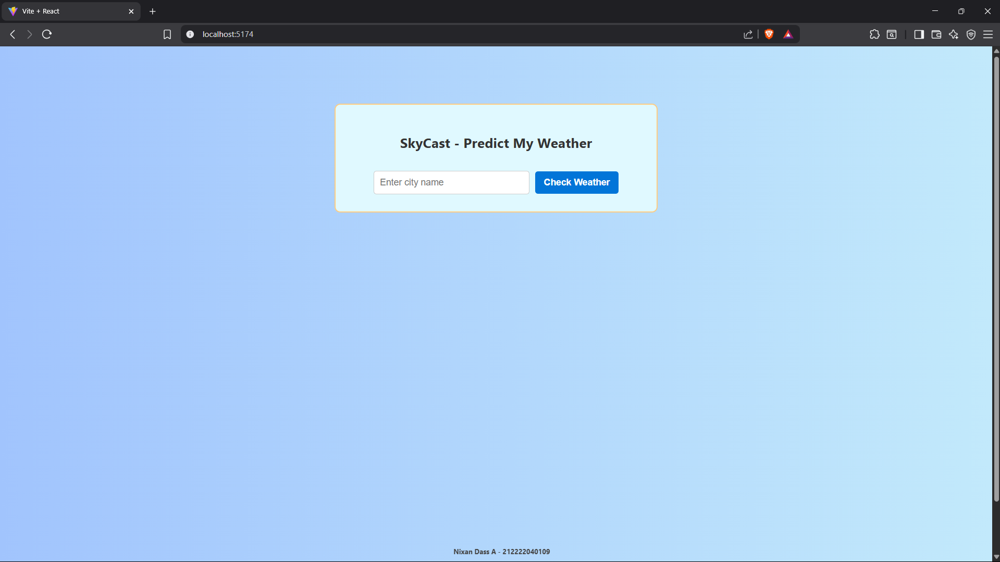
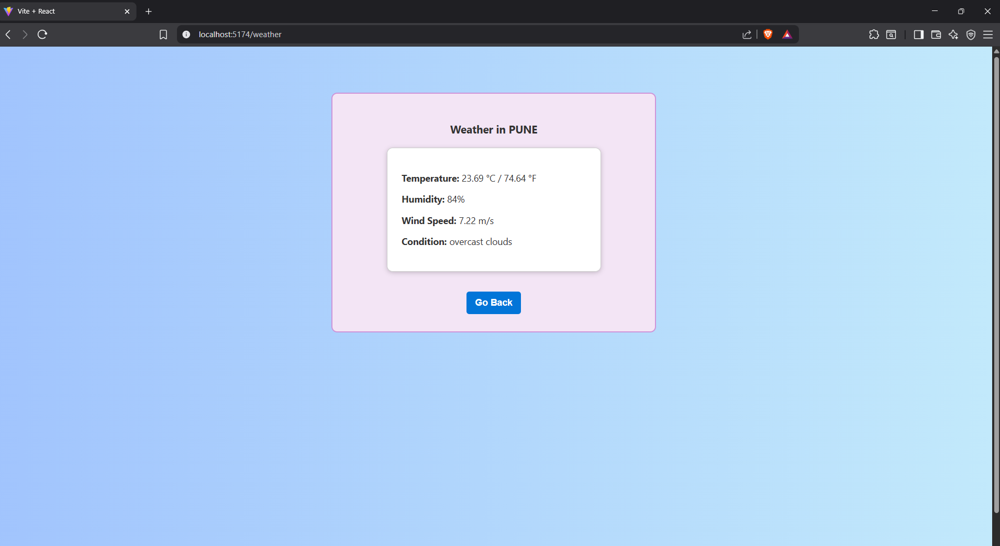
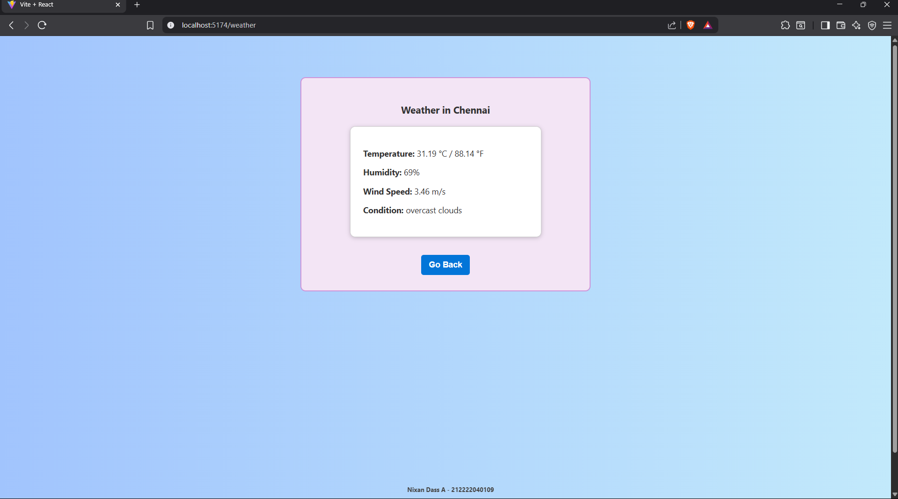

# SkyCast - Find My Weather
## Date: 22/07/25
## Objective:
To build a responsive single-page application using React that allows users to enter a city name and retrieve real-time weather information using the OpenWeatherMap API. This project demonstrates the use of Axios for API calls, React Router for navigation, React Hooks for state management, controlled components with validation, and basic styling with CSS.
## Tasks:

#### 1. Project Setup
Initialize React app.

Install necessary dependencies: npm install axios react-router-dom

#### 2. Routing
Set up BrowserRouter in App.js.

Create two routes:

/ – Home page with input form.

/weather – Page to display weather results.

#### 3. Home Page (City Input)
Create a controlled input field for the city name.

Add validation to ensure the input is not empty.

On valid form submission, navigate to /weather and store the city name.

#### 4. Weather Page (API Integration)
Use Axios to fetch data from the OpenWeatherMap API using the city name.

Show temperature, humidity, wind speed, and weather condition.

Convert and display temperature in both Celsius and Fahrenheit using useMemo.

#### 5. React Hooks
Use useState for managing city, weather data, and loading state.

Use useEffect to trigger the Axios call on page load.

Use useCallback to optimize form submit handler.

Use useMemo for temperature conversion logic.

#### 6. UI Styling (CSS)
Create a responsive and clean layout using CSS.

Style form, buttons, weather display cards, and navigation links.

## Programs:
### App.jsx
```
// App.jsx
import React from "react";
import { Routes, Route } from "react-router-dom";
import City from "./City";
import Weather from "./Weather";
import "./App.css";

function App() {
  return (
    <div className="app-container">
      <Routes>
        <Route path="/" element={<City />} />
        <Route path="/weather" element={<Weather />} />
      </Routes>
      <div className="footer">Nixan Dass A - 212222040109</div>
    </div>
  );
}

export default App;

```
### City.jsx
```

import React, { useState, useCallback } from "react";
import { useNavigate } from "react-router-dom";

function City() {
  const [enteredCity, setEnteredCity] = useState("");
  const [errorCity, setErrorCity] = useState(false);
  const navigate = useNavigate();

  const handleSubmitCity = useCallback(
    (e) => {
      e.preventDefault();
      if (enteredCity.trim() === "") {
        setErrorCity(true);
      } else {
        setErrorCity(false);
        navigate("/weather", { state: { userCity: enteredCity } });
      }
    },
    [enteredCity, navigate]
  );

  return (
    <div className="mainBox">
      <h2>SkyCast - Predict My Weather</h2>
      <form onSubmit={handleSubmitCity}>
        <input
          type="text"
          placeholder="Enter city name"
          value={enteredCity}
          onChange={(e) => setEnteredCity(e.target.value)}
        />
        <button type="submit">Check Weather</button>
      </form>
      {errorCity && <p className="error-text">City name is required!</p>}
    </div>
  );
}

export default City;

```
### Weather
```
// Weather.jsx
import React, { useEffect, useState, useMemo } from "react";
import { useLocation, useNavigate } from "react-router-dom";
import axios from "axios";

function Weather() {
  const { state } = useLocation();
  const cityNow = state?.userCity;
  const navigate = useNavigate();

  const [climate, setClimate] = useState(null);
  const [loadingWeather, setLoadingWeather] = useState(true);

  useEffect(() => {
    if (!cityNow) {
      navigate("/");
      return;
    }

    const getWeatherData = async () => {
      try {
        const response = await axios.get(
          `https://api.openweathermap.org/data/2.5/weather?q=${cityNow}&appid=2f07def66e4adafa624f927461efa78c&units=metric`
        );
        setClimate(response.data);
      } catch (err) {
        console.error("Weather API error", err);
      } finally {
        setLoadingWeather(false);
      }
    };

    getWeatherData();
  }, [cityNow, navigate]);

  const tempCelsius = useMemo(() => {
    return climate ? climate.main.temp.toFixed(2) : "";
  }, [climate]);

  const tempFahrenheit = useMemo(() => {
    return climate ? ((climate.main.temp * 9) / 5 + 32).toFixed(2) : "";
  }, [climate]);

  if (loadingWeather) return <p>Loading weather data...</p>;
  if (!climate) return <p>Weather information not available.</p>;

  return (
    <div className="infoBox">
      <h3>Weather in {cityNow}</h3>
      <div className="card">
        <p>
          <b>Temperature:</b> {tempCelsius} °C / {tempFahrenheit} °F
        </p>
        <p>
          <b>Humidity:</b> {climate.main.humidity}%
        </p>
        <p>
          <b>Wind Speed:</b> {climate.wind.speed} m/s
        </p>
        <p>
          <b>Condition:</b> {climate.weather[0].description}
        </p>
      </div>
      <button onClick={() => navigate("/")}>Go Back</button>
    </div>
  );
}

export default Weather;

```

### App.css
```
.mainBox {
  text-align: center;
  background-color: #e0f9ff;
  border: 2px solid #ffcc80;
  width: 500px;
  margin: 60px auto;
  padding: 30px;
  border-radius: 10px;
}

.infoBox {
  text-align: center;
  background-color: #f3e5f5;
  border: 2px solid #ce93d8;
  width: 500px;
  margin: 60px auto;
  padding: 30px;
  border-radius: 10px;
}

input {
  padding: 10px;
  font-size: 16px;
  width: 70%;
  border-radius: 5px;
  border: 1px solid #999;
}

button {
  margin-top: 15px;
  padding: 10px 20px;
  font-weight: bold;
  border-radius: 5px;
  border: none;
  background-color: #ffab91;
  cursor: pointer;
}

.card {
  text-align: left;
  padding: 20px;
  background-color: #fff;
  border: 1px solid #ccc;
  margin-top: 20px;
  border-radius: 8px;
}

.footer {
  position: absolute;
  font-weight: bold;
  bottom: 10px;
  left: 10px;
  color: #555;
}
```
## Output:



## Result:
A responsive single-page application using React that allows users to enter a city name and retrieve real-time weather information using the OpenWeatherMap API has been built successfully. 
